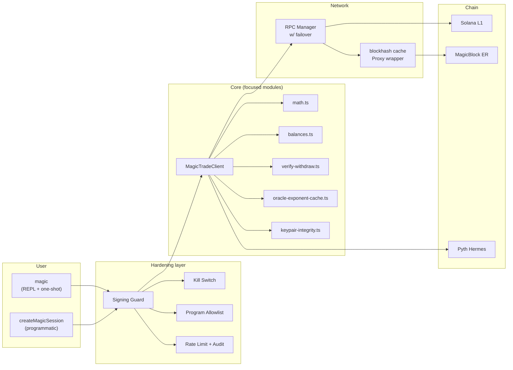

<div align="center">

<pre>
   ███████╗██╗      █████╗ ███████╗██╗  ██╗
   ██╔════╝██║     ██╔══██╗██╔════╝██║  ██║
   █████╗  ██║     ███████║███████╗███████║
   ██╔══╝  ██║     ██╔══██║╚════██║██╔══██║
   ██║     ███████╗██║  ██║███████║██║  ██║
   ╚═╝     ╚══════╝╚═╝  ╚═╝╚══════╝╚═╝  ╚═╝
              MAGIC  ·  TERMINAL
</pre>

# **`flash-builder-terminal`**

### The same Flash Magic Terminal, packaged around the latest Flash Trade V2 Builder API.

<sub>Bloomberg-grade · sub-200 ms confirms · 295 tests · v0.5.0 · Node 22+</sub>

[](https://www.npmjs.com/package/flash-builder-terminal)
[](https://www.npmjs.com/package/flash-builder-terminal)
[](https://github.com/Abdr007/flash-builder-terminal/actions/workflows/ci.yml)
[](https://bundlephobia.com/package/flash-builder-terminal)
[](LICENSE)
[](package.json)
[](https://github.com/Abdr007/flash-builder-terminal/issues)
[](https://github.com/Abdr007/flash-builder-terminal/commits/main)

[](https://solana.com)
[](https://magicblock.gg)
[](https://flash.trade)
[](https://pyth.network)
[](https://no-dna.org)
[](tsconfig.json)

</div>

---

```bash
cd flash-builder-terminal
npm install
npm run build
npm link
flash-builder init
flash-builder
```

A **Bloomberg-grade** trading terminal for [Flash Magic Trade](https://beta.flash.trade) running on **MagicBlock ephemeral rollups**. Trades commit on the ER in **~200 ms**, settle to Solana L1 in the background. Natural-language commands, atomic reverse, inline TP/SL, live Pyth + on-chain OI monitor, hardened SDK — all in your terminal.

This repo keeps the existing `magic` / `flash-magic` terminal feel intact and adds a dedicated global launcher for this builder-focused repo:

- `flash-builder`

The V2 Builder surface wired here includes market data reads, owner basket snapshots, positions/orders reads, preview endpoints, transaction builders, withdrawal recovery builders, and the live owner WebSocket basket stream.

---

## Contents

[Why](#-why-this-exists) ·
[Install](#-install) ·
[Quickstart](#-quickstart) ·
[Speed](#-speed) ·
[Commands](#-command-reference) ·
[Architecture](#-architecture) ·
[Security](#-security) ·
[SDK](#-programmatic-sdk) ·
[Testing](#-testing) ·
[Agent mode](#-no_dna-agent-mode) ·
[Configuration](#-configuration) ·
[FAQ](#-faq) ·
[Roadmap](#-roadmap) ·
[Contributing](#-contributing) ·
[License](#-license)

---

## ✦ Why this exists

Trading perps from a browser is the wrong shape for power users — the round-trip from intent to fill is bottlenecked by clicks, modals, and confirm dialogs. This terminal gives traders the same primitives the protocol exposes, with **no UI in the way**:

- **Sub-200 ms ER confirms** vs. 5–15 s on raw L1
- **Natural-language dispatch** — `long SOL 5 2x`, `close 50% of BTC short`, `reverse SOL long`, `set SOL long tp 100 sl 70`
- **Atomic reverse** in a single tx (vs. close+open race)
- **Inline TP/SL** bundled into the open ix (no second tx, no inter-trade cooldown)
- **Programmatic SDK** — `import { createMagicSession } from 'flash-builder-terminal/sdk'`
- **Agent-mode** (`NO_DNA=1`) — JSON output, structured errors, designed for orchestration

It is also a **reference implementation** of every safety practice you'd want around an automated signing path: persistent kill switch, program-ID allowlist, chain-truth verification on withdrawals, sentinel-aware journals, SSRF defence on RPC URLs, signing audit log. See [`THREAT_MODEL.md`](THREAT_MODEL.md).

### What it's NOT

To save you reading further if it's not what you want:

- ❌ **Not a custodial UI**. You hold your own keys. There's no service.
- ❌ **Not a backtester / paper-trading simulator**. Every signed action goes to chain.
- ❌ **Not a Flash Trade alternative front-end** for casual traders. The browser UI is better for first-time users; this is built for keyboard-driven power-users and agents.
- ❌ **Not a hardware-wallet bridge**. Software keypairs only (Ledger support on the roadmap).
- ❌ **Not multi-sig**. Single signer.

If any of those are dealbreakers, you want a different tool.

---

## ✦ Install

| Platform | Command |
|---|---|
| **Local repo** | `npm install && npm run build && npm link` |
| **Direct one-shot** | `node dist/index.js --help` |

After `npm link`, all three launchers are on PATH: `flash-builder`, `magic`, and `flash-magic`. Use `flash-builder` as the repo-specific global keyword, and `flash-magic` on systems where `magic` collides with ImageMagick.

---

## ✦ Quickstart

```bash
$ magic init
◆  Flash Magic Terminal — first-run setup

✔  Wallet detected: ABDR (5RaP…kE5j)  ~/.config/solana/id.json
RPC URL — paste Helius / QuickNode / Triton, or [enter] for public
> ⏎
✔  RPC reachable: api.mainnet-beta.solana.com  slot 418008028  (176 ms)
✔  Wrote ~/.magic/.env

Ready.  Run magic to start.
```

**One question maximum.** `magic init --quick` skips even that — auto-detects the wallet, uses the public RPC, applies sensible default caps, writes a complete `.env`.

```bash
magic init --quick      # zero prompts
magic                   # ready in ~5 seconds
```

The wizard runs **automatically** on first launch when no env file exists — modeled after `gh auth login`, `vercel`, `bun install`. A brand-new user typing `magic` after `npm install -g` gets walked through setup before the REPL even boots.

Then in the REPL:

```bash
markets                        # see what's tradable (52 markets across 5 asset classes)
price SOL                      # live oracle price
setup                          # initialise on-chain accounts (one-time)
deposit USDC 50                # fund the basket
long SOL 5 2x                  # open a 2x long with 5 USDC collateral
close SOL long                 # close it
```

---

## ✦ Speed

```
  Doctor — full system health probe
  ────────────────────────────────────────────────────────────────────────
  ✔   18ms  poolconfig    27 custodies · 52 markets
  ✔  162ms  rpc           Helius · slot 418006681
  ✔   51ms  er            block 37776727
  ✔  644ms  pyth          584 crypto feeds
  ✔        wallet        Dvvz…LfmK
  ✔    1ms  sdk           magic-trade-client v1.0.23 · 112 IDL errors mapped
  ✔        kill-switch   inactive (signing enabled)
  ✔        read-cache    256-entry · LRU · in-flight coalesced
  ────────────────────────────────────────────────────────────────────────
  all systems nominal  · 877ms total
```

| Operation | p50 | Notes |
|---|---|---|
| `magic --version` | **~80 ms** | Cold — Node startup only (early-exit before SDK loads) |
| `magic --help` | ~180 ms | Cold — full CLI graph (figlet/gradient lazy-loaded) |
| `magic markets` | **~10 ms** | Warm — read-cache hit |
| `magic price SOL` | **~30 ms** | Warm — oracle cache + Pyth fallback for fresh wallets |
| `magic open SOL long 5 2` | **~250 ms** | Cold — synthesised quote + ER submit |
| `magic close SOL long` | **~250 ms** | Atomic close ix |
| `magic reverse SOL long` | **~280 ms** | Atomic close+open in single tx |
| ER confirm window | **<400 ms** | We return on submit (`MAGIC_FAST_CONFIRM=true`) and surface post-confirm errors via background watcher |

### How the speed is built

| Optimisation | Effect |
|---|---|
| **ER blockhash cache** (Proxy-wrapped Connection) | -30–80 ms per trade |
| **Synthesised quotes** (cached oracle + 4-bp fee model) | -300–500 ms per trade vs. SDK simulate |
| **Per-instance oracle exponent cache** | First TP/SL pays no oracle round-trip |
| **Background oracle warmer** (after first read) | Subsequent opens skip the simulate entirely |
| **Read cache w/ in-flight coalescing** | 256-entry LRU; concurrent reads share one RPC call |
| **Lazy-loaded figlet + gradient-string** | Non-banner paths skip ~30 ms of import cost |
| **`--version` early-exit** | ~100 ms saved on a path users hit constantly |

---

## ✦ Command reference

### Trading
```bash
long SOL 5 2x                   # Open a long (collateral 5 USDC, 2x leverage)
short BTC 100 3x                # Open a short
open SOL long 5 2               # Same as `long`, verb-first
open SOL long 5 2 tp 100 sl 70  # Open with TP+SL bundled into the same tx
close SOL long                  # Close a position
reverse SOL long                # Atomic flip — close + open opposite, single tx
increase SOL long 10            # Grow position size by $10
partial SOL long 5              # Close $5 of an existing position
close 50% of SOL long           # Close half by percent
close $20 of BTC short          # Close $20 by USD amount
close all                       # Market-close every open position
add SOL long 5                  # Add 5 USDC of collateral
remove SOL long 5               # Remove $5 of collateral
```

### Orders
```bash
limit SOL long 80 50 2          # Limit order: open at $80, 50 USDC, 2x
limit SOL long 80 50 2 tp 100 sl 70  # Same, with TP/SL prices attached
tp SOL long 95                  # Take-profit at $95
sl SOL long 80                  # Stop-loss at $80
set SOL long tp 100 sl 70       # Attach BOTH TP + SL to an existing position
orders                          # Show all open orders + triggers (numbered)
cancel 0                        # Cancel order #0 from the last `orders` listing
cancel 0..4                     # Cancel a range of orders
cancel all                      # Cancel every open order
```

### Vault
```bash
deposit USDC 50                 # Fund the basket
withdraw USDC 25                # Withdraw to wallet (chain-truth verified)
withdraw-status                 # Did the last withdraw actually land on-chain?
withdraw-watch                  # Tail in-flight withdraw confirmations
vault                           # Per-token balances + locked + available
account                         # Flash Account vs wallet, side-by-side
settle                          # Drain pending credits/debits across all custodies
```

### Setup / safety / observability
```bash
init                            # First-run wizard (one prompt or zero)
init --quick                    # Zero-prompt setup
env                             # Show env file path + values (masked)
setup                           # On-chain init: UDL + basket + delegate (idempotent)
doctor                          # Full health probe — RPC, ER, oracle, wallet, SDK
perf                            # Read-cache hit rate + RPC latency telemetry
kill / resume                   # Persistent kill switch — refuse / re-allow signing
feedback "msg"                  # Save a local note + env fingerprint
monitor                         # Live market TUI (q to exit)
portfolio                       # Positions, PnL, vault balance
history                         # Recent trades (local journal)
```

Inside the REPL, type `help <verb>` for per-command usage. Run `help` for the full grouped reference.

---

## ✦ Architecture



The trading client `MagicTradeClient` is the orchestration core. Pure logic is split into focused, independently-tested modules:

| Module | Responsibility | Tested by |
|---|---|---|
| [`client/math.ts`](src/client/math.ts) | PnL, liquidation distance, fee estimates, oracle decode | property tests (fast-check) |
| [`client/balances.ts`](src/client/balances.ts) | Vault balance composition (deposits − debits + pendingCredits) | unit tests |
| [`client/oracle-exponent-cache.ts`](src/client/oracle-exponent-cache.ts) | Per-instance Pyth exponent cache (no devnet → mainnet bleed) | unit tests |
| [`client/verify-withdraw.ts`](src/client/verify-withdraw.ts) | Chain-truth dual-signal verifier (ATA balance + basket drop) | unit tests |
| [`client/audit-type.ts`](src/client/audit-type.ts) | L1 ix-bundle → SigningAuditEntry classifier | unit tests |
| [`client/keypair-integrity.ts`](src/client/keypair-integrity.ts) | Pre-sign integrity check (zeroed-secret + pubkey match) | unit tests |
| [`utils/cached-blockhash-connection.ts`](src/utils/cached-blockhash-connection.ts) | Proxy wrapper for ER blockhash caching | smoke tests |

Full design notes in [`THREAT_MODEL.md`](THREAT_MODEL.md). Devnet runbook in [`docs/RUNBOOK_DEVNET.md`](docs/RUNBOOK_DEVNET.md).

---

## ✦ Security

| Layer | What it protects |
|---|---|
| **Persistent kill switch** | `~/.magic/disabled` flag refuses every signing path across restarts |
| **Program-ID allowlist** | Every instruction's `programId` checked before signing |
| **Per-trade caps** | Max collateral, max leverage, max position size, max trades/min — enforced before any RPC call |
| **Confirm gate** | `MAGIC_AUTO_CONFIRM=false` (default) shows a per-action card and waits for `y` |
| **Chain-truth on withdraw** | ATA balance + basket dual signal, 15% slippage — never reports failure when funds moved |
| **Sentinel signatures** | `'already-landed'` / `'expired-but-landed'` filtered from URLs + history (no broken Solscan links) |
| **SSRF defence** | `validateRpcUrl` rejects RFC1918, link-local, IMDS (169.254.169.254), IPv4-mapped private |
| **Keypair hygiene** | Secret zeroed on disconnect / SIGTERM / uncaughtException; integrity checked before every sign |
| **Audit log** | `~/.magic/signing-audit.log` (no key material; ed25519 shapes redacted from logger output) |
| **Config size cap** | `~/.magic/config.json` refuses files > 256 KiB (no OOM via malicious config) |
| **Rate limit + cooldown** | `MAX_TRADES_PER_MINUTE` + `MIN_DELAY_BETWEEN_TRADES_MS`, enforced atomically across composite ops |

Disclosure policy in [`SECURITY.md`](SECURITY.md). Full asset / adversary / boundary mapping in [`THREAT_MODEL.md`](THREAT_MODEL.md).

---

## ✦ Programmatic SDK

```ts
import { createMagicSession, TradeSide } from 'flash-builder-terminal/sdk';

const magic = await createMagicSession({
  walletKeypairPath: '~/.config/solana/id.json',
  network: 'mainnet-beta',
});

const { positions, totalUnrealizedPnl } = await magic.getPortfolio();
const open = await magic.openPosition('SOL', TradeSide.Long, 50, 2);
console.log(`opened: ${open.txSignature}  entry $${open.entryPrice}`);

await magic.shutdown();
```

Same hardened path as the CLI — signing guard, rate limit, kill switch, audit log, RPC validation, program allowlist. Errors are typed (`ValidationError`, `NetworkError`, `TradingError`, `GuardError`, `ConfigError`) — branch on `instanceof` rather than parsing strings.

```ts
try {
  await magic.openPosition('SOL', TradeSide.Long, 5, 2);
} catch (err) {
  if (err instanceof TradingError) {
    console.error(`Anchor ${err.anchorCode} (${err.anchorName}): ${err.message}`);
    if (err.cause) console.error('caused by:', err.cause);
  } else if (err instanceof GuardError) {
    console.error('refused by safety guard:', err.message);
  } else {
    throw err;
  }
}
```

---

## ✦ Testing

```bash
npm test                  # unit + property (~200 cases, ~700 ms)
npm run test:property     # property-based money-math invariants (fast-check)
npm run test:integration  # devnet lifecycle smoke (gated on secrets)
npm run typecheck         # strict TS
npm run lint              # ESLint
npm run smoke:local       # mirror of CI smoke for local pre-flight
```

| Tier | Coverage | When |
|---|---|---|
| **Dispatch** | 116 cases — parser → schema across every verb / synonym / typo | Every PR |
| **Unit** | `composeBalanceMap`, `OracleExponentCache`, `verifyKeypairIntact`, `verifyWithdrawLanded`, `inferL1AuditType`, `renderCard` snapshots | Every PR |
| **Property** | `priceToNumber`, `liquidationPriceEstimate`, `pnlUsd`, `effectiveLeverage`, `feeUsdEstimate`, `liquidationDistance`, all `format.ts` | Every PR |
| **Integration** | Full devnet lifecycle: connect → markets → oracle → portfolio → preview → balances | Every push (when secrets configured) |
| **Writes (release-only)** | Real deposit → open → close → withdraw on devnet | Pushes to `release/**` |

The integration smoke caught **4 real bugs** in its first session (network/pool default mismatch, getter-only-field assignment, missing-basket crash, base58 trailing newline). It's the test that pays for itself fastest.

---

## ✦ NO_DNA agent mode

```bash
NO_DNA=1 magic markets
# {"ts":"...","kind":"result","alias":"markets","success":true,"data":{...}}

NO_DNA=1 magic open SOL long 5 2
# {"ts":"...","kind":"result","alias":"open","success":true,"txSignature":"...",...}
```

[NO_DNA spec](https://no-dna.org) — JSON to stdout, structured errors to stderr, no prompts, no banner, debug-verbose logs. Designed for orchestration by autonomous agents.

The CLI is also shipped with a [`SKILL.md`](SKILL.md) for Claude Code / Cursor — drop it into your skills directory and your editor agent learns the verb grammar end-to-end.

---

## ✦ Configuration

```
~/.magic/.env                # primary config (written by `magic init`)
~/.magic/config.json         # per-field overrides (managed by `rpc set/add/remove`)
~/.magic/magic.log           # rotating debug log (10 MiB)
~/.magic/signing-audit.log   # append-only signing audit
~/.magic/magic-history.jsonl # local trade journal
~/.magic/feedback.jsonl      # `magic feedback` capture
~/.magic/disabled            # kill-switch flag (presence = signing refused)
```

**Precedence**: process env > `.env` > `config.json` > built-in defaults.

See `magic env` for the live merged view. See `magic doctor` for an at-a-glance subsystem health probe.

---

## ✦ FAQ

**Q: Do I need a custom RPC?**
A: No, but you should. The public Solana RPC rate-limits hard; one bad minute and your trades stall. Helius / QuickNode / Triton free tiers cover anything short of HFT — paste the URL into the wizard's one prompt and you're done.

**Q: Does it work with my hardware wallet?**
A: Not yet. Software keypairs only (Solana CLI format JSON file). Ledger support is on the roadmap but not committed.

**Q: Can I run multiple instances on the same machine?**
A: Yes. Each `MagicTradeClient` is per-instance (oracle cache, blockhash cache, SDK state). A devnet smoke and a mainnet REPL can run side-by-side without bleeding into each other.

**Q: What happens if a withdraw "fails" but my funds actually moved?**
A: Chain-truth verification kicks in — we compare ATA balance + basket balance before/after with 15% slippage tolerance. If chain says success, we report success regardless of what the SDK threw. Sentinel signatures (`'expired-but-landed'`) are filtered from history so you don't get broken Solscan links.

**Q: How do agents use this?**
A: `NO_DNA=1` makes everything JSON. The SDK gives you typed error classes. There's a [`SKILL.md`](SKILL.md) for Claude Code / Cursor that teaches the verb grammar in one drop-in.

**Q: Can I edit the source and run it directly?**
A: Yes. Clone, `npm install`, `npm run dev` — the REPL runs from TypeScript via `tsx` without rebuilding.

**Q: How do I report bugs?**
A: Run `magic feedback "thing broke"` to capture an env fingerprint (no secrets, ever), then attach `~/.magic/feedback.jsonl` to a [GitHub issue](https://github.com/Abdr007/flash-builder-terminal/issues).

---

## ✦ Roadmap

Roughly in order of likelihood:

- [ ] Pyth-direct fallback for `previewOpen` on fresh wallets (parity with `price`) — currently skipped in the integration smoke
- [ ] Ledger / hardware-wallet support
- [ ] Browser-based auth flow (a la `gh auth login`) for managed RPC providers
- [ ] Devnet WRITES smoke automation (auto-funding from project faucet, run on every release branch)
- [ ] Built-in chart subcommand (`magic chart SOL 1h`)
- [ ] Strategy DSL — declarative entry / exit rules running inside `magic` as a daemon
- [ ] Web SDK build (subset that runs in a browser/Worker)

PRs welcome — pick anything, open an issue first if it's substantial.

---

## ✦ Contributing

Bug reports, feature requests, and PRs welcome. See [`CONTRIBUTING.md`](CONTRIBUTING.md) for the workflow — including how to run the devnet integration smoke locally before pushing.

For security issues, please follow the disclosure policy in [`SECURITY.md`](SECURITY.md) — **do not file public issues for vulnerabilities**.

### Local dev setup

```bash
git clone https://github.com/Abdr007/flash-builder-terminal.git
cd flash-builder-terminal
npm install
npm run dev          # run the CLI directly from TypeScript (tsx)
npm test             # run the unit + property suite
npm run smoke:local  # devnet integration smoke (needs MAGIC_TEST_KEYPAIR_BASE58 + MAGIC_TEST_DEVNET_RPC env)
```

---

## ✦ Acknowledgements

- [**Flash Trade**](https://flash.trade) — the perpetuals protocol this terminal targets
- [**MagicBlock**](https://magicblock.gg) — ephemeral-rollup infrastructure that makes sub-second confirms possible
- [**Pyth Network**](https://pyth.network) — price feeds + market-hours schedules
- The trading-CLI tradition — `bashtrader`, `birdwatcher`, `xchange-bot` — for proving keyboard-driven execution beats clicks

---

## ✦ License

MIT — see [`LICENSE`](LICENSE).

<div align="center">
<sub>Built with care.  ·  <a href="https://github.com/Abdr007/flash-builder-terminal/issues">Report a bug</a>  ·  <a href="https://www.npmjs.com/package/flash-builder-terminal">npm</a>  ·  <a href="https://github.com/Abdr007/flash-builder-terminal/releases">Releases</a></sub>
</div>
